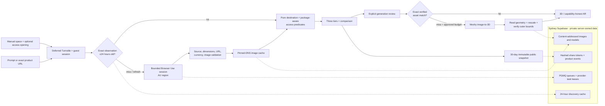

# Fitment

**Compare furniture that fits your measured space—with delivery risks flagged before you buy.**

2nd place out of 117 teams at Founders, Inc. Night Hack.

[Live demo](https://app-input.vercel.app) ·
[CI](https://github.com/tuilachit/nighthackathon/actions/workflows/quality.yml)

[](https://github.com/tuilachit/nighthackathon/actions/workflows/quality.yml)

> **Demo GIF placeholder:** replace this block with
> `docs/assets/fitment-demo.gif` after recording the final phone walkthrough.

## Architecture



`/fit` is the single product journey. A prompt searches IKEA Australia and
Kmart Australia; an exact-link request checks one safe public retailer URL.
Fresh observations are reusable only for the exact normalized intent and
extraction schema for 24 hours, then dimensions are re-evaluated against the
current visitor's space. Provider notifications are treated only as wake-ups:
the server always re-fetches canonical provider state before committing data.
See
[`docs/live-search-backend.md`](docs/live-search-backend.md) for the state,
security, and recovery design.

### Catalog provenance

| Retailer | Products | JSON-LD | LLM-extracted | Retailer API |
| --- | ---: | ---: | ---: | ---: |
| IKEA | 77 | 69 | 8 | 0 |
| Target | 40 | 0 | 0 | 40 |
| Wayfair | 3 | 0 | 3 | 0 |
| **Total** | **120** | **69** | **11** | **40** |

Every row passed the same exact-dimension, source-URL, attribution, and
high-confidence validation gate before entering the bundled snapshot.

## How it works

### 1. A request becomes a durable, bounded job

The visitor either describes a need or submits one exact HTTPS product URL.
Guest authentication and Turnstile are deferred until submission. The job,
measurement, cache policy, provider task, and recovery state are committed
before any paid call. Reloading `/fit?job=…` restores the owner-scoped job.

### 2. Destination-space fit runs before ranking

All measurements use millimetres. The engine conservatively reduces the usable
space by measurement uncertainty and a centralized clearance policy:

- `20 mm` on each side;
- `20 mm` behind the product; and
- `10 mm` above the product.

Each product is evaluated upright in its default orientation and rotated 90
degrees on the floor. Height never rotates. A boundary equality passes. When
both orientations fit, the engine chooses the one with the greatest minimum
clearance. Products that fail remain in a separate near-miss collection with a
stable dimensional reason.

### 3. Access fit is a separate predicate

When a narrowest access width is known, width, depth, and height are sorted
from smallest to largest. The two smallest axes form the transport
cross-section; ties resolve in `width`, `depth`, then `height` order. The
opening must clear both axes after uncertainty and side allowances.

Complete delivery packages are checked first; the worst package controls. When
package dimensions are unavailable, assembled dimensions are used and labeled
as an advisory. Unknown access produces no pass claim. A destination fit that
fails the known opening appears in a separate warning tier with its deficit.

### 4. Valid products are ranked and compared

Fits, access warnings, and near misses remain separate. Products from every tier
can be compared against the same envelope, but generation is available only
for a destination fit without a known access failure. Each result preserves its
listed currency, observation time, evidence, availability, package basis, and
retailer source; currencies are never converted for a price-difference claim.

### 5. The selected product is placed at checked outer dimensions

The user first reviews the frozen source image, listed dimensions, limitations,
and expected wait. An existing model is reused only when the product snapshot,
source-image bytes, dimensions, Meshy settings, and processing version match.
Otherwise one explicitly approved Meshy job may run when the model budget gate
is enabled. Embedded geometry is rescaled to the listed dimensions and checked
to `0.1 mm`; this verifies outer bounding-box scale, not replica fidelity.

## Legacy catalog compatibility

The current ingestion tools use deterministic IKEA, Target, and Wayfair
adapters. A record enters the runtime snapshot only when the catalog validator
accepts the complete catalog.

The gate rejects:

- missing or non-positive width, height, or depth;
- missing verification source or verification date;
- duplicate IDs;
- invalid retailer, image, or product URLs;
- negative prices or unsupported categories; and
- model metadata whose verified bounds do not match the product dimensions.

This 120-product US snapshot is available only through an explicit legacy/demo
path. It never mixes with Australian live observations or their currencies.

## Repository structure

```text
app/fit/                         Fitment route and server catalog load
components/fit/                  Search, results, comparison, and AR viewer UI
components/agent/                Lazy live-job controller and live result cards
app/api/v1/search-jobs/          Owner-scoped search, status, cancel, approval
app/api/v1/comparison-shares/    Hashed immutable public comparison snapshots
lib/live-search/                 Provider, validation, cache, security, and jobs
lib/access-fit.ts                Pure access-opening predicate
lib/delivery-access.ts           Package-aware access wrapper
lib/fit-engine.ts                Pure destination-space predicate
lib/query-parser.ts              Deterministic intent parser and AI validation
lib/product-ranker.ts            Result partitioning and stable ranking
lib/catalog-source.ts            Bundled runtime catalog boundary
lib/catalog-validation.ts        All-or-nothing catalog validation
lib/measurement-geometry.ts      Pure measurement and unit geometry
lib/model-scaling.ts             Verified model scaling and placement types
scripts/catalog/ingestion/       Retailer-specific offline adapters
scripts/catalog/generate-*.ts    Resumable Meshy generation and verification
supabase/migrations/             Additive private-schema queue and cache design
public/catalog.json              Bundled validated catalog snapshot
public/models/                   Cached GLB and USDZ assets
```

UI components do not perform fit mathematics or retailer ingestion. Those
rules live in pure TypeScript modules with unit tests.

## Run locally

Requirements:

- Node `24.3.0` (see [`.nvmrc`](./.nvmrc))
- npm `10.9.8`

```bash
npm ci
npm run dev
```

Open [http://localhost:3000/fit](http://localhost:3000/fit).

The explicit legacy/demo path works without credentials. The live Australian
journey needs server credentials and a Sydney Supabase project:

```bash
cp .env.example .env.local
```

Relevant environment variables:

| Variable | Purpose |
| --- | --- |
| `OPENAI_API_KEY` | Optional query enrichment, transcription, and legacy concept analysis |
| `OPENAI_QUERY_MODEL` | Optional query-extraction model override |
| `OPENAI_TRANSCRIPTION_MODEL` | Optional transcription model override |
| `NEXT_PUBLIC_SUPABASE_URL` | Sydney project URL |
| `NEXT_PUBLIC_SUPABASE_PUBLISHABLE_KEY` | Browser auth key |
| `SUPABASE_SECRET_KEY` | Server-only database and Storage access |
| `NEXT_PUBLIC_TURNSTILE_SITE_KEY` | Browser-visible deferred anti-abuse challenge; configure the matching secret in Supabase Auth, not Vercel |
| `BROWSER_USE_API_KEY` | Bounded live retailer browsing |
| `BROWSER_USE_WEBHOOK_SECRET` | Signed Browser Use notifications |
| `BROWSER_USE_MODEL` | Live browsing model; `bu-mini` by default |
| `MESHY_API_KEY` | Explicitly approved live model generation |
| `MESHY_WEBHOOK_SECRET` | Opaque Meshy webhook capability |
| `CRON_SECRET` / `ABUSE_HASH_SECRET` | Recovery and privacy-bounded abuse controls |
| `ENABLE_MESHY` | Enables offline batch generation when `true` |
| `FIRECRAWL_API_KEY` | Offline legacy catalog ingestion only |
| `ANTHROPIC_API_KEY` | Strict structured extraction for missing retailer facts |
| `NOTION_TOKEN` | Optional legacy waitlist integration |

The full variable list, durable scheduler setup, circuit breakers, and security
boundaries are documented in
[`docs/live-search-backend.md`](docs/live-search-backend.md). Model generation
is disabled in the database by default; enabling it is an explicit operator
decision after a credit-safe smoke test.

Never commit `.env.local` or generated credential files.

## Verification

```bash
npm run verify
npm run e2e
```

`npm run verify` runs TypeScript, ESLint, Vitest, and a production build.
GitHub Actions runs that gate plus the Pixel 5 Playwright flow for every push
to `main` and every pull request.

## Honest limitations

- The explicit legacy snapshot contains 77 IKEA, 40 Target, and 3 Wayfair
  products. Wayfair coverage is intentionally smaller because ingestion
  stopped at the first provider credit-exhaustion signal.
- The deployed `/fit` route starts with first-class manual tape-measure entry.
  A labeled demo fixture remains available for walkthroughs. WebXR measurement
  geometry exists, but live capture is not wired into this portfolio build.
- The access predicate models one narrowest opening. It does not simulate
  turns, stairs, packaging, disassembly, ceiling height, or a complete route.
- AR behavior depends on device support. Android can use WebXR or Scene Viewer;
  fixed-scale iPhone Quick Look requires a verified USDZ asset.
- Only selected hero products have shape-accurate cached meshes. Other products
  use dimensionally accurate boxes.
- Live dimensions may be agent-extracted from axis-labelled retailer
  evidence and checked for internal numeric consistency. They are not an
  independent physical measurement; users should confirm the retailer page
  before purchase.
- Meshy output is AI-generated. The live pipeline verifies only its outer
  bounding-box dimensions, not shape fidelity or moving/internal parts.
- Retailer adapters collect public factual product data for a prototype.
  Commercial use requires authorized feeds and a review of retailer terms.
- Optional AI enrichment and offline ingestion/asset tools require network
  access and credentials; the fit, comparison, and placeholder-viewer path
  does not.

## Award disclosure

The generic concept-to-3D prototype routes predate Night Hack. The fit-first
catalog validation, conservative fit/access predicates, cross-retailer
comparison, dimension-checked model scaling, and furniture workflow were the hackathon
submission. Baseline tags remain in Git for provenance.
