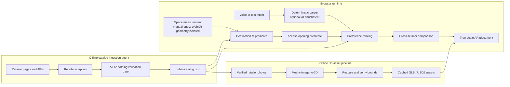

# Fit-First Furniture Search

**Only shows furniture that actually fits—your space and your front door.**

2nd place out of 117 teams at Founders, Inc. Night Hack.

[Live demo](https://app-input.vercel.app/fit) ·
[CI](https://github.com/tuilachit/nighthackathon/actions/workflows/quality.yml)

[](https://github.com/tuilachit/nighthackathon/actions/workflows/quality.yml)

> **Demo GIF placeholder:** replace this block with
> `docs/assets/fit-first-demo.gif` after recording the final phone walkthrough.

## Architecture



Retailer fetching and model generation are kept off the search request path.
The deployed app reads a validated catalog snapshot and cached hero assets, so
fit and comparison remain deterministic when external APIs are unavailable.

### Catalog provenance

| Retailer | Products | JSON-LD | LLM-extracted | Retailer API |
| --- | ---: | ---: | ---: | ---: |
| IKEA | 77 | 69 | 8 | 0 |
| Target | 40 | 0 | 0 | 40 |
| Wayfair | 3 | 0 | 3 | 0 |
| **Total** | **120** | **69** | **11** | **40** |

Every row passed the same exact-dimension, source-URL, attribution, and
high-confidence validation gate before entering the bundled snapshot.

## How it works

### 1. Intent becomes a deterministic query

The local parser extracts category, budget, material, color, style, and keyword
preferences from text. Optional AI enrichment can add missing fields, but it
cannot replace explicitly parsed category or budget values. Search still works
without an API key.

### 2. Destination-space fit runs before ranking

All measurements use millimetres. The engine conservatively reduces the usable
space by measurement uncertainty and a centralized clearance policy:

- `20 mm` on each side;
- `20 mm` behind the product; and
- `10 mm` above the product.

Each product is evaluated upright in its default orientation and rotated 90
degrees on the floor. Height never rotates. A boundary equality passes. When
both orientations fit, the engine chooses the one with the greatest minimum
clearance. Products that fail remain in a separate near-miss collection with a
stable dimensional reason.

### 3. Access fit is a separate predicate

When a narrowest access width is known, width, depth, and height are sorted
from smallest to largest. The two smallest axes form the transport
cross-section; ties resolve in `width`, `depth`, then `height` order. The
opening must clear both axes after uncertainty and side allowances.

A product that fits the destination but fails this check is never presented as
a fit. It appears in a separate access-failure collection with its exact
deficit.

### 4. Valid products are ranked and compared

Only products that pass the physical predicates reach the main result list.
Ranking then considers category, budget, preference matches, fit confidence,
minimum clearance, price, and stable ID. Up to three products can be compared
across retailers using the same dimensions and clearance metrics.

### 5. The selected product is placed at verified scale

Hero product photos are converted to GLBs through Meshy outside the critical
search path. Each mesh is rescaled to the catalog record's verified
width/height/depth and its scene bounds are checked before the asset path is
attached. Products without a cached mesh use a unit box scaled to the same
verified dimensions rather than an invented model size.

## Catalog ingestion

The current ingestion tools use deterministic IKEA, Target, and Wayfair
adapters. A record enters the runtime snapshot only when the catalog validator
accepts the complete catalog.

The gate rejects:

- missing or non-positive width, height, or depth;
- missing verification source or verification date;
- duplicate IDs;
- invalid retailer, image, or product URLs;
- negative prices or unsupported categories; and
- model metadata whose verified bounds do not match the product dimensions.

The deployed application never scrapes a retailer during a user search.

## Repository structure

```text
app/fit/                         Fit-first route and server catalog load
components/fit/                  Search, results, comparison, and AR viewer UI
lib/access-fit.ts                Pure access-opening predicate
lib/fit-engine.ts                Pure destination-space predicate
lib/query-parser.ts              Deterministic intent parser and AI validation
lib/product-ranker.ts            Result partitioning and stable ranking
lib/catalog-source.ts            Bundled runtime catalog boundary
lib/catalog-validation.ts        All-or-nothing catalog validation
lib/measurement-geometry.ts      Pure measurement and unit geometry
lib/model-scaling.ts             Verified model scaling and placement types
scripts/catalog/ingestion/       Retailer-specific offline adapters
scripts/catalog/generate-*.ts    Resumable Meshy generation and verification
public/catalog.json              Bundled validated catalog snapshot
public/models/                   Cached GLB and USDZ assets
```

UI components do not perform fit mathematics or retailer ingestion. Those
rules live in pure TypeScript modules with unit tests.

## Run locally

Requirements:

- Node `24.3.0` (see [`.nvmrc`](./.nvmrc))
- npm `10.9.8`

```bash
npm ci
npm run dev
```

Open [http://localhost:3000/fit](http://localhost:3000/fit).

The bundled catalog, deterministic parser, fit engine, comparison, and cached
models work without credentials. For optional integrations:

```bash
cp .env.example .env.local
```

Relevant environment variables:

| Variable | Purpose |
| --- | --- |
| `OPENAI_API_KEY` | Optional query enrichment, transcription, and legacy concept analysis |
| `OPENAI_QUERY_MODEL` | Optional query-extraction model override |
| `OPENAI_TRANSCRIPTION_MODEL` | Optional transcription model override |
| `MESHY_API_KEY` | Offline cached-model generation |
| `ENABLE_MESHY` | Enables Meshy generation when `true` |
| `FIRECRAWL_API_KEY` | Default offline retailer-page extraction |
| `BROWSER_USE_API_KEY` | Bounded rendered-page fallback for offline ingestion |
| `ANTHROPIC_API_KEY` | Strict structured extraction for missing retailer facts |
| `NOTION_TOKEN` | Optional legacy waitlist integration |

Never commit `.env.local` or generated credential files.

## Verification

```bash
npm run verify
npm run e2e
```

`npm run verify` runs TypeScript, ESLint, Vitest, and a production build.
GitHub Actions runs that gate plus the Pixel 5 Playwright flow for every push
to `main` and every pull request.

## Honest limitations

- The bundled portfolio snapshot contains 77 IKEA, 40 Target, and 3 Wayfair
  products. Wayfair coverage is intentionally smaller because ingestion
  stopped at the first provider credit-exhaustion signal.
- The deployed `/fit` route starts with first-class manual tape-measure entry.
  A labeled demo fixture remains available for walkthroughs. WebXR measurement
  geometry exists, but live capture is not wired into this portfolio build.
- The access predicate models one narrowest opening. It does not simulate
  turns, stairs, packaging, disassembly, ceiling height, or a complete route.
- AR behavior depends on device support. Android can use WebXR or Scene Viewer;
  fixed-scale iPhone Quick Look requires a verified USDZ asset.
- Only selected hero products have shape-accurate cached meshes. Other products
  use dimensionally accurate boxes.
- Retailer adapters collect public factual product data for a prototype.
  Commercial use requires authorized feeds and a review of retailer terms.
- Optional AI enrichment and offline ingestion/asset tools require network
  access and credentials; the fit, comparison, and placeholder-viewer path
  does not.

## Award disclosure

The generic concept-to-3D prototype routes predate Night Hack. The fit-first
catalog validation, conservative fit/access predicates, cross-retailer
comparison, verified model scaling, and furniture workflow were the hackathon
submission. Baseline tags remain in Git for provenance.
