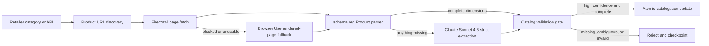

# Catalog ingestion agent

The ingestion agent runs offline and publishes a validated
`public/catalog.json`. Product search never calls a retailer, Firecrawl,
Browser Use, or Claude at runtime.



## Fallback order

1. **Retailer API:** Exact dimensions supplied by a retailer API are accepted
   with `dimensionsSource: "retailer-api"`.
2. **Firecrawl:** Known product pages are fetched as markdown, raw HTML, links,
   and direct image URLs. Firecrawl is the default page provider.
3. **Browser Use:** If Firecrawl cannot return usable content, or the static
   page still lacks the required product facts, one bounded Browser Use session
   expands product specifications and returns rendered visible text plus image
   URLs. A run creates at most eight sessions. Credit
   or quota errors never trigger another provider; they stop the run.
4. **JSON-LD:** `schema.org/Product` width, height, and depth are parsed before
   any model call. Explicit inches or centimetres are converted to whole
   millimetres.
5. **Claude:** If required fields remain missing, Claude Sonnet 4.6 receives
   page text and a strict JSON schema. Its prompt forbids estimates. Any
   response below `high` confidence is rejected.

## Validation gate

Every published record must have a stable ID, supported retailer and category,
positive USD price, exact positive `widthMm`, `heightMm`, and `depthMm`, an
HTTPS retailer URL, an HTTPS product image with attribution, verification
metadata, and high-confidence provenance:

```ts
interface CatalogProvenance {
  dimensionsSource: "json-ld" | "llm-extracted" | "retailer-api";
  sourceUrl: string;
  extractedAt: string;
  confidence: "high";
}
```

The complete catalog is validated before every write. Writes use a temporary
file and atomic rename, so an interrupted run cannot expose partial JSON.

## Resume and budget behavior

Run `npm run catalog:sync`. The ignored
`.cache/catalog-ingestion/state.json` checkpoint records accepted and rejected
product URLs, preventing completed pages from being fetched again. Each run
defaults to a 25-product batch; use `-- --batch-size=N` to change it.

The Phase 2 baseline is recorded on the first run. The agent will add at most
150 products beyond that baseline. It stops at the first credit-exhaustion
signal from Firecrawl, Browser Use, or Anthropic. Progress and the final
`.cache/catalog-ingestion/last-report.json` include Firecrawl pages fetched,
Browser Use sessions, Claude calls, retailer API requests, retailer counts, and
the provenance split. Each invocation also limits product-page attempts to
eight Wayfair pages and twelve IKEA pages; complete Target retailer-API records
do not require page extraction.

Required local variables are documented in `.env.example`:
`FIRECRAWL_API_KEY`, `BROWSER_USE_API_KEY`, and `ANTHROPIC_API_KEY`.
