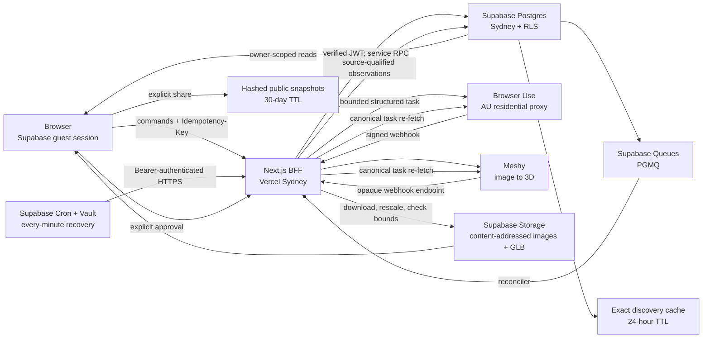
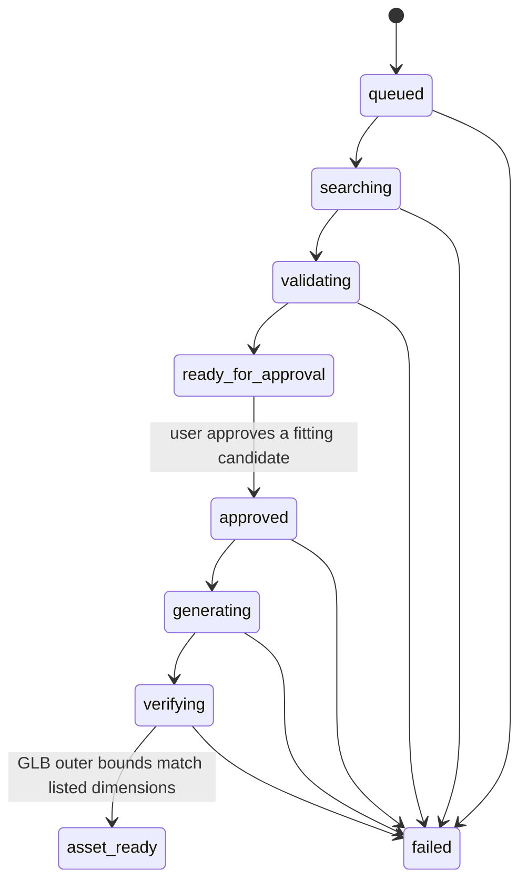

# Live-search backend

Fitment's canonical `/fit` journey is an asynchronous decision workflow for
Australian furniture. Prompt searches are bounded to IKEA Australia and Kmart
Australia; exact-link checks may inspect one safe public retailer page. The
legacy US catalog remains isolated behind explicit demo compatibility and never
mixes with live observations. Both paths use the same pure destination-fit and
access predicates.

## Architecture



The request path writes a command and its queue message in one database
transaction, then uses Next.js `after()` as a low-latency dispatch path. PGMQ
is the durable retry authority. A private Supabase Cron job reads its HTTPS URL
and bearer token from Vault and invokes the reconciler every minute. Each call
does at most one network-expensive operation and alternates queue work with
provider polling so neither path can starve.

An exact cache key includes normalized intent, sorted retailer scope, and the
extraction-schema version. A hit no older than 24 hours creates no Browser Use
task; stored dimensions are re-evaluated against the current measurement.
`force-refresh` deliberately bypasses that reuse path.

## Workflow



1. `POST /api/v1/session` creates or reuses a Supabase anonymous Auth session.
   Creating a new guest requires Cloudflare Turnstile; an existing signed-in
   guest is reused without another challenge.
2. `POST /api/v1/search-jobs` accepts a prompt or exact product-link intent,
   validates the measurement and cache policy, requires an idempotency key, and
   either completes from an exact recent observation or commits a PGMQ message.
3. Browser Use receives one stateless task, an Australian proxy, a strict JSON
   output schema, a hard result limit, and a hard USD cost ceiling. It may read
   only IKEA Australia and Kmart Australia product pages for prompts. A link
   task may visit only the submitted product page and a same-site canonical
   redirect; returned facts must remain on its registrable domain.
4. A signed Browser Use webhook is stored idempotently. The BFF re-fetches the
   canonical provider task; webhook data never becomes product data directly.
5. Records missing an exact assembled width, height, or depth, a safe retailer
   URL, an explicit axis-labelled evidence excerpt, a valid ISO-4217 listed
   currency, or high-confidence extraction are rejected. The server
   checks that evidence numbers agree with the structured dimensions. This is
   an agent-extraction consistency gate, not an independent measurement of the
   physical product. Images are fetched with pinned public DNS, redirect and
   byte limits, magic-byte/MIME checks, then cached under a content hash.
6. The pure destination predicate and package-aware access wrapper partition
   products into fits, access issues, and near misses. Listed packages control
   when complete; otherwise assembled dimensions are explicitly advisory.
   Only destination fits without a known access failure can be approved.
7. Approval freezes the product snapshot. An existing GLB is reused only when
   snapshot hash, source-image hash, dimensions, Meshy settings, and processing
   version match exactly. A miss enqueues generation only while the private
   model circuit breaker is deliberately enabled.
8. Meshy webhooks are treated as untrusted notifications because Meshy does not
   document request signing. The endpoint has a high-entropy URL token and the
   BFF always re-fetches the task with the server-side Meshy key.
9. The expiring GLB is capped at 25 MB, downloaded without redirects, checked
   for supported embedded geometry, and wrapped in an exact non-uniform scale.
   It is rejected unless all three world-space outer bounds match the approved
   listed dimensions within 0.1 mm. This verifies the bounding box, not Meshy's
   inferred shape or internal proportions. The result is stored under a
   content-addressed path.
10. `POST /api/v1/search-jobs/:id/cancel` terminalizes owner work before a
    best-effort Browser Use stop request. Ambiguous paid submissions are never
    blindly resubmitted. Public comparisons store only an immutable sanitized
    snapshot behind a hashed opaque token and expire after 30 days.

## Data ownership

- Browser requests use a Supabase guest JWT. Public workflow tables have
  forced RLS and owner-only read policies.
- Client code cannot insert or update workflows, candidates, approvals, assets,
  provider tasks, snapshots, webhooks, events, or queue messages.
- The Vercel BFF verifies the caller, then invokes service-role-only,
  `SECURITY INVOKER` RPCs. The service key is never exposed to the browser.
- Product observations and workflow events are append-only. Approval stores
  the exact workflow hash and product-snapshot hash used by model generation.
- Provider payloads have size caps. Authorization, cookies, API keys, and raw
  webhook signature headers are never persisted.
- Product and image URLs are treated as untrusted. Exact-link hosts are checked
  before dispatch; server image fetches pin public DNS on every redirect and
  validate MIME and magic bytes. Public image/model buckets allow reads but no
  browser writes; only the service worker owns content-hash paths.
- Share rows, discovery cache, reusable-model metadata, raw product events, and
  daily aggregates live in the private schema. Share tokens are stored only as
  SHA-256 hashes. Raw events expire after 30 days and never include raw queries,
  measurements, room names, product/workflow IDs, URLs, tokens, or free text.
- Paid actions are guarded independently by owner, HMAC-pseudonymized network,
  and global quotas plus database circuit breakers. Raw client IP addresses are
  never stored.

## Reliability and idempotency

- Search and approval commands require caller-generated idempotency keys.
- Database uniqueness constraints make repeat commands return the original
  workflow while rejecting a key reused with different input.
- Provider tasks are claimed transactionally by workflow stage and input hash.
  A submission lease prevents concurrent API calls from creating duplicate paid
  jobs. A returned provider ID is preserved even if the following database write
  fails, so recovery polls it and never submits it again.
- Webhook inbox rows deduplicate provider events by a stable event key and
  payload hash.
- Only an explicit pre-acceptance HTTP 429 is automatically retried: at most
  three provider POSTs, with backoff and the original deadline. Ambiguous
  submissions without an ID fail closed after a short lease; they are never
  blindly resubmitted. Browser tasks have a 10-minute deadline and Meshy tasks
  a 20-minute deadline.
- Workflows expire after 24 hours. Partial retailer coverage is stored and shown
  instead of silently presenting an incomplete comparison as complete.
- Active job identity is persisted in the URL and session storage. Realtime is
  a latency optimization; owner-scoped polling remains the recovery path.

## Provider configuration

Set all values in `.env.local` locally and in the Vercel project for production.
Never commit their values.

| Variable | Use |
| --- | --- |
| `NEXT_PUBLIC_SUPABASE_URL` | Supabase HTTPS project origin |
| `NEXT_PUBLIC_SUPABASE_PUBLISHABLE_KEY` | Browser-safe Auth/Data API key |
| `NEXT_PUBLIC_TURNSTILE_SITE_KEY` | Browser-visible Cloudflare Turnstile site key |
| `SUPABASE_SECRET_KEY` | Server-only database and Storage worker key |
| `BROWSER_USE_API_KEY` | Server-only Browser Use API key |
| `BROWSER_USE_WEBHOOK_SECRET` | Browser Use HMAC secret, at least 32 characters |
| `MESHY_API_KEY` | Server-only Meshy API key |
| `MESHY_WEBHOOK_SECRET` | Opaque Meshy webhook URL token, at least 32 characters |
| `CRON_SECRET` | Reconciler bearer secret, at least 32 characters |
| `ABUSE_HASH_SECRET` | HMAC key for non-reversible network quota identities |
| `BROWSER_USE_MAX_COST_USD` | Per-session hard cost ceiling |
| `LIVE_SEARCH_MAX_RESULTS` | Maximum structured products per search |

Configure the Browser Use project webhook to
`https://<production-host>/api/v1/webhooks/browser-use`. Configure the Meshy
account webhook to
`https://<production-host>/api/v1/webhooks/meshy?token=<MESHY_WEBHOOK_SECRET>`.
Both providers configure callbacks at account/project level, so the callback is
not sent in each task-creation body.

After migrations are applied, store the production callback and the exact same
`CRON_SECRET` in Supabase Vault. The scheduled command contains neither value:

```sql
select vault.create_secret(
  'https://<production-host>/api/internal/reconcile',
  'fitment_reconciler_url'
);
select vault.create_secret(
  '<same random value as CRON_SECRET>',
  'fitment_reconciler_secret'
);
```

On hosted projects, prefer **Supabase Dashboard → Database → Vault → New
secret** for these two entries. The hosted automation/Postgres role may not be
allowed to call `vault.create_secret()` directly; the Dashboard Vault UI uses
the platform-owned path without putting either value in a migration.

## Operational checks

Before enabling live traffic:

1. Apply migrations to the Sydney Supabase project, enable Anonymous Auth, and
   configure Turnstile in Supabase Auth.
2. Add both Vault secrets, invoke `private.invoke_fitment_reconciler()` once,
   and confirm an HTTP 200 in `net._http_response` plus a successful
   every-minute `cron.job_run_details` entry.
3. Generate database types and run Supabase security and performance advisors.
4. Test owner isolation with two guest users and test idempotent concurrent
   search, approval, and duplicate-webhook requests.
5. Send each provider's webhook test event and confirm the inbox is processed.
6. With explicit provider-budget approval, run one bounded live-search smoke.
7. With separate Meshy-credit approval, approve one fit, check the stored GLB bounding box, and verify a non-owner
   cannot read the workflow or asset record.
8. Alert on terminal failures, reconciliation backlog, provider spend, and
   workflows that remain non-terminal beyond their expiry window.

Expected user-perceived time is provider-dependent: retailer browsing is
normally tens of seconds; Meshy generation happens only after approval and can
take several minutes. The UI exposes those as separate durable stages and never
holds an HTTP request open for either operation.

The unified migration leaves `model_generation_enabled = false`. Cache hits may
reuse an already verified asset while the circuit is closed, but no new paid
Meshy task can be created until an operator explicitly changes that control.

The matching Turnstile secret belongs in Supabase Dashboard → Authentication →
Attack Protection → CAPTCHA. It is deliberately not a Vercel application
environment variable because Supabase Auth performs token verification.
